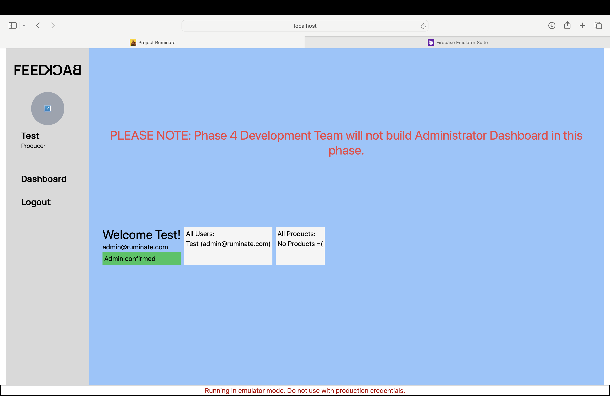

# Login to Ruminate

This doc is for the reference of the developers. It only explains how to setup and login with emulators. The steps covered are:
- Set Firebase connection to use Emulators 
- Set up admin on Authentication and Firestore Emulator
- Login to the Ruminate app as `admin`

<br>

Use Emulators
-----
Make sure you are set to using local Emulators and not Cloud Firestore.

Go to [api/firebase/index.ts](../src/components/api/firebase/index.ts) and check that you are connecting to the Emulators:
```
const auth = getAuth();
connectAuthEmulator(auth, "http://127.0.0.1:9099");
const db = getFirestore();
connectFirestoreEmulator(db, "127.0.0.1", 8080);
const storage = getStorage();
connectStorageEmulator(storage, "127.0.0.1", 9199);
```

Set up admin 
-----

To set up an admin on Authentication and Firestore Emulator:

1) With your emulators running go to `http://127.0.0.1:4000/auth`

2) Create an admin user with the `Add User` button. Use a dummy email such as `admin@test.com` and password that is secure. Mark the email as verified.

3) Once user is set up copy the `User UID`, you will need this in the following steps.

4) Go to the Firestore Emulator at `http://127.0.0.1:4000/firestore`

5) Create a `users` collection.

6) Create a new document in this collection with the <b>Document ID</b> set to the `User UID` you copied earlier.

<!-- Additional fields might be needed such as approved etc -->
7) Add these new fields to this document: `email`, `role`, `adminConfirmed`. Fill `email` field with the email you created, set `role` as `admin`, and set `adminConfirmed` to true. 


Login to the Ruminate app
----

Use your newly created admin credentials to login to Ruminate and see the placeholder dashboard like this: 



<br>

### Note: 
1) Phase 5 will need to add an Admin dashboard. As of now there is a placeholder dashboard that the admin will land on. This dashboard is available at [admin/admin-dashboard/index.tsx](/src/pages/users-related/admin/admin-dashboard/index.tsx)
2) You should be able to create a Producer and Evaluator in the same format but with different roles i.e., `producer` and `evaluator`. To login without errors you will also need to add a `uid` field for a non-admin user.